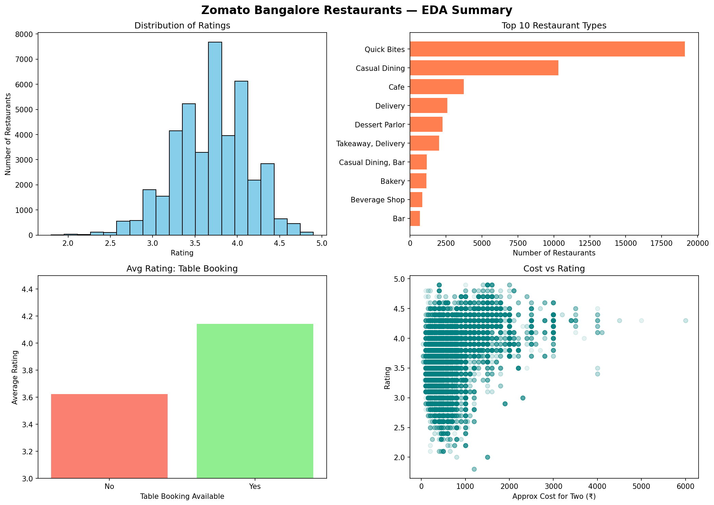

# Zomato EDA Project

## Overview
I analyzed Zomato's Bangalore restaurant data to understand what affects ratings, pricing, and restaurant types across the city.

## Dataset
The dataset (`zomato.csv`) is not included in this repo due to GitHub's file size limit (it's ~547 MB).

**Original source:** https://www.kaggle.com/datasets/himanshupoddar/zomato-bangalore-restaurants

To run this notebook yourself, download the dataset from the link above and place it in the same folder as the notebook.

## Tools & Libraries Used
- Python
- pandas
- matplotlib / seaborn
- Jupyter Notebook

## Key Insights
- Most restaurants are rated between 3.5 and 4.0 — very few fall below 2.5 or above 4.7
- "Quick Bites" is the most common restaurant type (~19,000), nearly double the second-most common type, "Casual Dining" (~10,000)
- Restaurants offering table booking have a noticeably higher average rating (~4.15) than those that don't (~3.6)
- Costlier restaurants (₹3000+ for two) are almost all rated 4.0 or above, while cheaper restaurants show much wider variation in ratings
- About 59% of restaurants offer online ordering
- Most restaurants charge between ₹300–800 for two people, with very few priced above ₹2000
- Areas like Sahakara Nagar and Indiranagar have the highest average ratings among the busiest locations

## Visualizations

## How to Run
1. Clone this repository
2. Download the dataset from the link above and place it in the project folder
3. Open `Zomato_EDA draft1.ipynb` in Jupyter Notebook
4. Run all cells

## Author
Shivalika Katoch